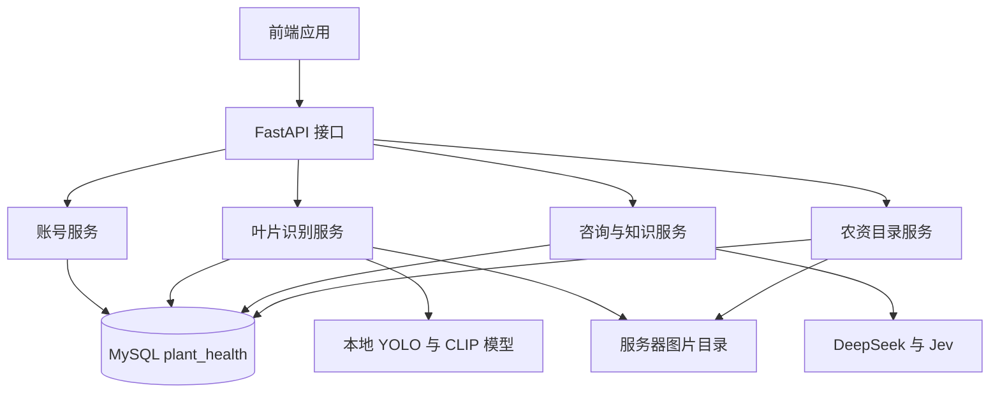
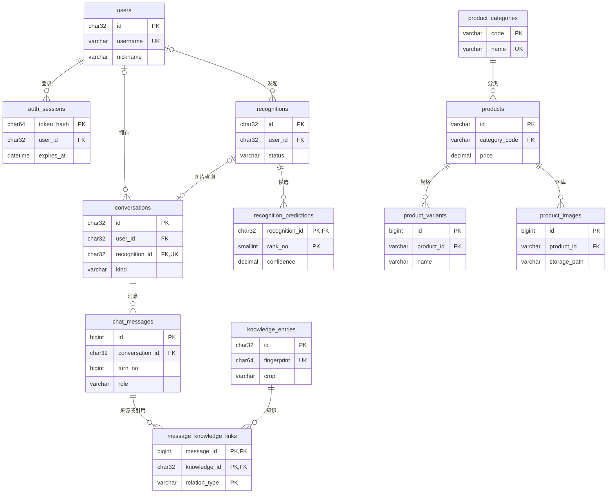

# 植物病虫害平台数据库设计

设计及实施日期：2026-10-08。状态：已创建远程 `plant_health` 的 12 张表，本地运行已接入 MySQL。数据迁移和验证详情见 [MYSQL_MIGRATION.md](MYSQL_MIGRATION.md)。

数据库名为 `plant_health`，部署在现有 MySQL 8.0.46 服务器上，使用 InnoDB 和 `utf8mb4_unicode_ci`。现有 `stu626` 承载设备管理业务，新平台使用自己的库，解决已有 `users` 表的业务与字段冲突。

本版按现有 FastAPI 路由、Pydantic 模型和存储代码设计，覆盖账号、叶片识别、植物咨询、通用知识和农资目录，共 12 张业务表。对应建表定义见 [plant_health_schema.sql](sql/plant_health_schema.sql)。

## 数据与服务的组织

MySQL 保存结构化业务数据，图片目录保存图片文件，数据库记录文件相对路径、过期时间或摘要。已有模型权重和模型标签配置继续由识别服务管理。连接配置从环境变量读取，业务服务通过公共连接池访问 MySQL。

## 表之间的关系

`PK` 表示主键，`FK` 表示外键，`UK` 表示唯一约束。用户与识别、会话的关联可空，支持现有匿名访问；识别与会话是可选的一对一关系，纯文字会话不需要图片。

## 12 张表及主要字段

| 模块 | 表 | 保存内容与主要字段 |
| --- | --- | --- |
| 用户 | `users` | `id`、`username`、`password_hash`、`nickname`、`phone`、`bio`、创建和修改时间 |
| 用户 | `auth_sessions` | 登录令牌的 `token_hash`、`user_id`、创建和过期时间 |
| 识别 | `recognitions` | 归属用户、图片名称和尺寸、模型、叶片检查、置信度阈值、返回候选数量、识别状态、耗时、结果图片路径及过期时间 |
| 识别 | `recognition_predictions` | 识别 ID、排名、模型类别 ID、英文和中文标签、作物、病害或健康状态、置信度 |
| 聊天 | `conversations` | 归属用户、可选识别 ID、会话类型、标题、识别或文字咨询上下文快照、版本号、有效期 |
| 聊天 | `chat_messages` | 会话 ID、轮次、用户或助手角色、正文、回复来源、模型、耗时、用量、Jev 检查、知识活动及截断标志 |
| 知识 | `knowledge_entries` | 标题、作物、病害、通用问答、适用条件、不确定性、关键词、去重指纹、搜索文本及整理模型 |
| 知识 | `message_knowledge_links` | 消息与知识的关联，区分入库来源 `source`、参考 `reference`、直接复用 `direct` |
| 商品 | `product_categories` | 现有七类的英文代码、中文名称和显示顺序 |
| 商品 | `products` | 名称、标题、分类、展示规格、报价区间、单位、起批量、商家、产地、采集来源、说明、属性、关键词和主图位置 |
| 商品 | `product_variants` | 同一商品的原始规格列表，逐规格保存名称、报价、单位及起批量 |
| 商品 | `product_images` | 同一商品的图库顺序、文件相对路径、来源地址、尺寸和 SHA256 |

完整字段类型、索引及外键规则在 SQL 定义中给出。JSON 用于结构可能随模型变化的叶片检查、Jev 返回值、模型用量、上下文快照，以及无需独立关联查询的关键词和商品属性；消息、候选、规格和图片采用独立行。

## 业务流如何落库

### 注册与登录

1. 注册生成现有格式的 32 位十六进制 UUID，写入 `users`，保留现有 scrypt 密码摘要格式。
2. 登录创建随机令牌，只把 SHA256 摘要写入 `auth_sessions`，明文令牌只返回给客户端。
3. 每次鉴权查询令牌摘要、有效期和所属用户；退出删除当前会话。默认登录有效期继续为 7 天。
4. 用户名统一转为小写，数据库唯一约束覆盖重复注册。

### 上传叶片并咨询

1. CLIP 叶片检查通过后，YOLO 生成分类候选。
2. 同一事务写入 `recognitions`、全部实际保留的 `recognition_predictions` 和 `conversations` 上下文，避免结果已存在但咨询上下文缺失。
3. 当前图片咨询沿用同一个 ID：`recognitions.id = conversations.id = request_id`。`conversations.recognition_id` 显式记录关系；普通文字咨询创建自己的会话 ID，关联识别字段为空。
4. 候选表保存满足界面 Top-K 和聊天上下文需要的候选全集。若界面只请求 Top-1，API 返回一条，但用于聊天的更多候选仍保存；排名 1 对应 `top_prediction`。
5. `class_name`、`display_name`、`crop`、`condition_name` 和 `is_healthy` 是当时的标签快照，后续模型或标签更新不会改变已有结果。
6. 图片先写入临时文件；数据库提交与文件发布之间采用应用层补偿和清理处理，SQL 事务本身不能回滚文件操作。

纯文字咨询直接创建 `kind='general'` 的 `conversations`，无需伪造识别或图片记录。

### 多轮聊天与知识复用

1. 读取会话上下文和最近 10 个完整轮次，按现有流程执行 Jev 检查、知识检索或 DeepSeek 生成。
2. 外部模型调用期间释放数据库连接和事务，避免长时间占用行锁。
3. 回复通过检查后，在一个短事务内验证用户、有效期和 `revision`，插入本轮用户与助手两条消息，并更新版本号和会话有效期；发生并发版本冲突则整个事务回滚。
4. 同一会话、轮次、角色具有唯一约束。助手行保存本轮模型、用量、问题与回复检查、知识活动；角色和正文对应现有对话历史格式。
5. 助手参考或直接复用的知识写入关联表。需要整理新知识时，沿用现有异步整理与复核流程，完成后写入知识条目、来源关联，并更新本轮的知识活动记录；知识整理失败仍可保留已成功的聊天回复。

模型拒绝、生成失败或版本冲突不会写入半个成功轮次。本版按当前成功问答流程设计；独立的失败请求日志可由现有应用日志承担。

### 通用知识与检索

`knowledge_entries` 拆出当前 `KnowledgeDraft` 的全部字段，指纹仍由规范化后的作物、病害、问题和适用条件生成。数据库唯一约束解决并发重复入库。

知识整理仍去除私人信息并保存适用条件和不确定性，`source_type` 使用当前 `ai_summary`，`expert_verified` 在本版继续为 `false`。`source_context_id` 对应旧库的 `source_recognition_id`，仅作为内部来源标识，不做外键；来源会话过期后，通用知识仍能独立使用。新消息的详细来源和复用关系由关联表记录。

统一的 `search_text` 使用 MySQL `FULLTEXT ... WITH PARSER ngram`，覆盖标题、作物、病害、问答、适用条件及关键词。MySQL 官方文档说明 ngram 支持中文，默认按双字符切分；它的停用词和排序规则与 SQLite FTS5 不同，因此迁移时需要核对实际服务器参数并验证检索召回。[MySQL ngram 文档](https://dev.mysql.com/doc/refman/8.0/en/fulltext-search-ngram.html)

短词或全文检索无有效词元时提供参数化 `LIKE` 兜底；通配符按普通字符转义。保留现有作物筛选、分页和 Jev 适用性复核流程。数据库检索命中只代表候选资料，直接复用仍由当前检查流程决定。

### 农资商品目录

已核实当前素材包含 **200 件商品、451 条规格和 562 张图片**，分属 7 个类别。

导入时保留 `hn-*` 商品 ID、原始列表顺序、图库顺序、展示规格、报价区间、单位、起批量、说明及完整来源信息。`products` 的展示报价直接采用现有字段，规格列表另存 `product_variants`，不从任意规格推导展示报价。图库记录保存下载图片元数据，`source_image_urls` 另保留原始来源数组。

主图以 `main_image_position` 指向本商品图库中的位置，应用在同一导入事务内验证主图存在并属于该商品。查询详情时按位置重建 `images`、`image_metadata` 和 `variants`，继续输出同域图片接口地址。

价格和起批量使用 `DECIMAL(18,6)`，导入时采用十进制；接口适配层继续按现有响应模型输出。当前 200 件目录采用从 MySQL 加载、缓存 30 秒的完整快照，在内存中筛选和排序，保留“单汉字可搜索、多个词全部匹配”的规则。数据量扩大时可将筛选、排序和分页下推到数据库。

## 标识、时间和保留规则

- 用户、识别、会话和知识 ID 延续现有 32 位 UUID；商品 ID 延续 `hn-*`；消息、规格和图片采用内部自增 ID。
- 库内时间统一为 UTC 的 `DATETIME(6)`，连接设置为 `+00:00`；接口适配层把账号时间转回当前 Unix 时间戳，把商品采集时间输出为带时区的 ISO 字符串。
- 会话默认 24 小时有效，每次成功回复续期；结果图片默认 24 小时有效，与会话续期分别处理。设置继续来自现有 TTL 配置。
- 清理过期会话会级联删除其消息和知识关联，然后删除对应识别及候选；知识条目保留。即使会话仍有效，结果图片也可能已经过期，数据库和图片接口需要一致地反映这一情况。
- 当前方案保持会话的过期机制。若要增加用户长期识别历史，应把“咨询可继续的截止时间”和“历史记录保留期限”分开，再新增历史查询接口。
- 匿名识别和文字会话允许 `user_id=NULL`，继续使用当前随机 ID 的访问方式。登录后不自动认领匿名会话；已有用户会话仍校验所属用户。
- 用户与识别、会话的外键使用 `RESTRICT`，防止删除账号时把私有记录变成匿名记录；账号删除需要由应用显式清理所属内容。登录会话、识别候选、会话消息、商品规格和图库按父记录级联清理。
- 删除消息只清理来源或引用关联，不删除通用知识；有关联的知识条目使用 `RESTRICT`，主动删除知识时需显式处理关联与消息中的引用快照。

## 数据库与应用分别保证什么

数据库保证主键、用户名唯一、令牌摘要唯一、知识指纹唯一、排名与图库位置唯一、引用存在，以及置信度、报价区间、起批量等基础范围约束。

应用继续保证 UUID 格式、注册和资料字段规则、匿名访问边界、识别与会话所属用户一致、纯文字会话的识别关联为空、新图片会话具有识别关联并使用同一请求 ID、每轮两条消息的原子性、JSON 内部结构、主图归属及消息与知识关联的业务含义。旧图片会话的迁移例外见下文。这些要求不能仅靠独立外键表达。

SQL 定义中的 `CHECK` 只涉及非外键列；涉及外键列的跨字段规则在事务内验证，遵守 MySQL 对检查约束与外键参照动作的限制。[MySQL CHECK 文档](https://dev.mysql.com/doc/refman/8.0/en/create-table-check-constraints.html)

## 从当前项目迁移的对应关系

| 当前来源 | 目标表或结构 | 迁移要点 |
| --- | --- | --- |
| `chat.sqlite3.users` | `users` | 保留 ID、用户名、密码摘要和个人资料，转换时间 |
| `chat.sqlite3.auth_sessions` | `auth_sessions` | 保留未过期令牌摘要及用户归属 |
| `chat.sqlite3.conversations.context` | `conversations`；图片咨询另拆出 `recognitions` 和候选 | 根据上下文类型识别图片或纯文字会话，保留归属和有效期 |
| `chat.sqlite3.conversations.history` | `chat_messages` | 将现有数组按角色和轮次拆行，保留原有顺序和版本号 |
| `knowledge.sqlite3.knowledge_entries.content` | `knowledge_entries` | 拆出通用知识字段，保留 ID、指纹和整理模型，生成搜索文本 |
| SQLite FTS5 `knowledge_search` | MySQL 全文索引 | 重新建立索引并验证召回与排序 |
| `Shop/data/products.json` | 分类、商品、规格、图库四张表 | 一次事务导入，保留报价及所有来源字段 |
| `Visual/storage/results/` 和 `Shop/data/images/` | 文件目录 + 数据库路径 | 文件继续由图片接口提供，数据库记录路径与元数据 |

旧的聊天上下文只保留了部分识别信息，没有完整图片尺寸、完整叶片检查和推理耗时。因此旧数据迁移应先保留上下文到 `conversations.context_snapshot`，旧图片会话仍使用 `kind='recognition'`，但无法恢复的识别关联允许为空，并在快照内标记为旧数据；完整的 `recognitions` 从新请求开始写入。旧历史中只有角色和正文，模型、检查、用量等缺失字段留空，不编造值。

当前 SQLite 已裁剪过的历史无法恢复，拆行只迁移实际保留的问答。利用原 `revision` 将这些问答映射到最新的连续轮次；新轮次使用 `revision + 1`，避免覆盖已有消息。

实施包含建表定义与导入工具验证、旧数据导入及核对、各存储实现与连接配置改造，以及现有接口、真实识别、多轮并发、会话归属、过期清理、知识检索和图片访问验证。当前运行配置已切换至 MySQL。

当前后端的商城部分提供目录展示与查询。若后续要同步前端演示购物车，可增加 `cart_items`；订单、库存或支付需要对应的新业务流程和接口，再设计相应表。

## 实施范围

建表定义已在远程 MySQL 执行。本地运行使用 `.env` 中的 MySQL 配置；SQLite 和商品 JSON 保留给迁移来源及隔离的离线测试。服务器 `ngram_token_size` 已核实为 2。真实 MySQL 验证使用单独的临时库，不向业务库写入测试账号或测试问答。

2026-10-09 增加结构化引导：`context_snapshot.guidance` 保存当前问题、实际报告的信息和会话版本；每轮完整问答与引导状态在同一事务更新，消息继续记录用量、Jev 检查和参考知识关系。无需新增表或执行 DDL。已补充信息也用于正常聊天和知识检索，原始识别分数保持不变。流程见 [引导接口说明](GUIDANCE_API.md)。
